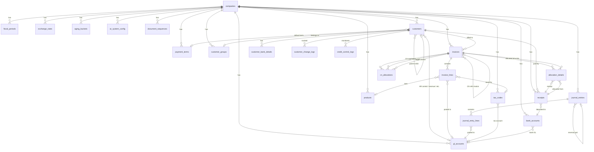

# TSH Synergy ERP — AR Module Database Schema

## Overview

PostgreSQL 15+ database schema for the Accounts Receivable module of TSH Synergy ERP, designed for deployment on **Supabase**.

## Quick Start

Run the following SQL files **in order** in the Supabase SQL Editor:

```
1. database/001_create_tables.sql    → 23 tables, indexes, triggers, constraints
2. database/002_create_views.sql     → 5 views, 3 utility functions
3. database/003_seed_data.sql        → Reference data & default configuration
```

## Architecture

### Table Summary (23 Tables)

| Layer | Tables | Description |
|-------|--------|-------------|
| **Base Config** (10) | `companies`, `gl_accounts`, `bank_accounts`, `fiscal_periods`, `payment_terms`, `tax_codes`, `customer_groups`, `exchange_rates`, `aging_buckets`, `ar_system_config` | System-level configuration tables |
| **Product** (1) | `products` | Simplified placeholder for item master |
| **Sequence** (1) | `document_sequences` | Document numbering sequences |
| **Customer** (2) | `customers`, `customer_bank_details` | Customer master data |
| **Transaction** (5) | `invoices`, `invoice_lines`, `receipts`, `allocation_details`, `cn_allocations` | Core AR transactions |
| **Journal** (2) | `journal_entries`, `journal_entry_lines` | Accounting journal entries |
| **Audit** (3) | `customer_change_logs`, `credit_control_logs`, `report_audit_logs` | Audit trail tables |

### Views & Functions

| Name | Type | Purpose |
|------|------|---------|
| `v_customer_credit_utilization` | VIEW | Real-time credit utilization (BR-CM-005) |
| `v_invoice_aging` | VIEW | Invoice-level aging analysis (BR-AG-002) |
| `v_customer_aging_summary` | VIEW | Customer-level aging pivot table |
| `v_customer_ar_summary` | VIEW | Customer AR financial dashboard |
| `v_receipt_summary` | VIEW | Receipt status with allocation count |
| `get_next_sequence()` | FUNCTION | Atomic document number generation |
| `calculate_due_date()` | FUNCTION | Due date calculation per payment terms |
| `get_effective_tax_rate()` | FUNCTION | Tax rate lookup by effective date |
| `fn_aging_report()` | FUNCTION | Aging report with custom cutoff date |
| `fn_customer_statement_activity()` | FUNCTION | Customer activity statement with running balance |

### Key Design Decisions

| Decision | Rationale |
|----------|-----------|
| UUID primary keys | Supabase native; distributed-safe; no collisions |
| Invoice/CN/DN in single `invoices` table | PRD requirement; simplifies allocation queries |
| `credit_utilization` as VIEW (not stored) | PRD BR-CUS-005; always real-time; no stale data |
| JSONB for `shipping_addresses` & `alt_contacts` | Supabase-friendly; reduces table count; flexible schema |
| Sub-table for `invoice_lines` | Transactional integrity; FK constraints; indexable |
| `cn_allocations` separate from `allocation_details` | CN-to-invoice and Receipt-to-invoice are distinct processes |
| Optimistic locking via `version` column | Prevents concurrent edit conflicts on invoices |

## ER Diagram



## PRD Coverage Matrix

| PRD Section | DB Implementation |
|-------------|------------------|
| Part 1 §2.1 — Customer General | `customers` table |
| Part 1 §2.2 — Customer Contact | `customers` (billing addr + JSONB shipping/contacts) |
| Part 1 §2.3 — Customer Finance | `customers` (GL account FKs, credit fields) |
| Part 1 §3 — Credit Management | `v_customer_credit_utilization` + `credit_control_logs` |
| Part 1 §4 — Payment Terms | `payment_terms` + `calculate_due_date()` |
| Part 1 §5 — Account Mapping | GL FK columns on `customers` + `ar_system_config` fallback |
| Part 1 §6 — Change Management | `customer_change_logs` |
| Part 2 §2.1 — Invoice Header | `invoices` table |
| Part 2 §2.2 — Invoice Lines | `invoice_lines` table |
| Part 2 §3 — Invoice Status Machine | `invoices.status` CHECK + `idx_invoices_overdue_check` |
| Part 2 §4 — Credit Note | `invoices` (doc_type='Credit Note') + CN-specific columns |
| Part 2 §5 — Tax Logic | `tax_codes` + `get_effective_tax_rate()` |
| Part 2 §7 — Debit Note | `invoices` (doc_type='Debit Note') |
| Part 3 §2 — Receipt | `receipts` table |
| Part 3 §3 — Allocation | `allocation_details` table |
| Part 3 §4-6 — Reconciliation | `allocation_details` + `cn_allocations` |
| Part 3 §7 — Auto Allocation | `allocation_method` column (Manual/FIFO/Amount) |
| Part 4 §2 — Aging Analysis | `v_invoice_aging` + `v_customer_aging_summary` + `fn_aging_report()` |
| Part 4 §3 — Customer Statement | `fn_customer_statement_activity()` |
| Part 4 §4-5 — AR Summary | `v_customer_ar_summary` |
| Part 5 — Journal Entries | `journal_entries` + `journal_entry_lines` |
| Part 5 §5 — Permissions | Application layer (not in DB schema) |

## Seed Data Inventory

| Entity | Count | Source |
|--------|-------|--------|
| Companies | 1 | TSH Synergy Sdn Bhd |
| GL Accounts | 22 | PRD Part 5 §1.1 |
| Bank Accounts | 1 | Default Maybank |
| Fiscal Periods | 12 | 2026 full year |
| Payment Terms | 13 | PRD Part 1 §4.2 |
| Tax Codes | 9 | PRD Part 2 §5.2 |
| Customer Groups | 5 | Trade/Non-Trade/Related/Govt/Export |
| Aging Buckets | 5 | Current/1-30/31-60/61-90/90+ |
| System Config | 23 | Defaults + Account mappings |
| Exchange Rates | 10 | USD/SGD/EUR → MYR |
| Doc Sequences | 6 | CUST/INV/CN/DN/RCT/JE |
