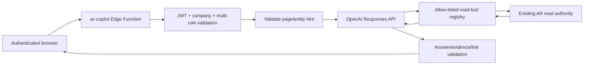

# Post-Modernization AR Copilot

Backend: **CLOSED / PASS — PRODUCTION v1 ACTIVE**

Frontend: **CLOSED / PASS — PRODUCTION READY**

Production: **CLOSED / PASS**

The reviewed implementation commit `3381d34aff0f94a5c5fa54e80b8d9fa0c8423eea`
is deployed. Supabase `ar-copilot` v1 is ACTIVE with bundle SHA-256
`f2c55b4c8d3ab31dbaabbd3e7d8addca671482365635fbad44fc9714356db2fa`, and Vercel
deployment `dpl_3nQqV4c8Sn3CrgKvyvdPJhG16Yci` is READY on the canonical Production
URL. No database migration was required.

## 1. Purpose and authority boundary

AR Copilot is a context-aware, read-only assistant for this Accounts Receivable module. It explains system behavior, retrieves narrowly scoped operational evidence, and recommends safe application screens. It is not financial authority and is not a generic database or ChatGPT proxy.

The initial version has no tool that can create, update, post, cancel, allocate, reverse, deliver, configure, assign, or delete anything. OpenAI cannot connect to PostgreSQL. The browser cannot call a privileged Copilot RPC and never receives a service-role credential.



The deterministic backend and PostgreSQL remain authoritative for financial data. Tool results are bounded evidence; business strings inside those results are untrusted data and cannot change policy or authorization.

## 2. Existing OpenAI authority reused

The implementation reuses the established OpenAI configuration posture:

- secret: `OPENAI_API_KEY`;
- endpoint: OpenAI Responses API;
- model validation and default: the current document-intelligence model authority;
- Copilot override: optional server-only `OPENAI_COPILOT_MODEL`, otherwise `OPENAI_DOCUMENT_MODEL`, otherwise the established default;
- requests use `store: false`;
- bounded response reading, timeout, limited retry, and sanitized provider errors.

The existing document provider remains document-only with `tools: []`. AR Copilot therefore has a dedicated tool-capable adapter without changing Document Intelligence behavior or its financial fail-closed boundary.

## 3. HTTP contract

### Route

`POST /ar-copilot/chat`

`OPTIONS` is supported through the shared CORS handler. Every other method/path returns the existing sanitized route-not-found shape.

Company context uses the existing `X-Company-Id` mechanism, but membership and roles are derived from the authenticated bearer identity. A request body cannot supply `company_id`, `user_id`, a system prompt, a developer prompt, or a service credential.

### Request

```json
{
  "messages": [
    { "role": "user", "content": "Why is this invoice still open?" }
  ],
  "context": {
    "page": "invoice_detail",
    "entity_type": "invoice",
    "entity_id": "00000000-0000-0000-0000-000000000000"
  }
}
```

Only `user` and `assistant` conversation messages are accepted; the last message must be from the user. Entity context is a hint. Before it reaches OpenAI, the backend proves that the entity exists in the current company and that the authenticated user can read it. An inaccessible cross-company identifier is indistinguishable from unavailable context.

Supported entity hints are:

- `customer`;
- `invoice`;
- `credit_note`;
- `debit_note`;
- `receipt`;
- `automation_document`;
- `automation_exception`;
- `journal_entry`;
- `audit_event`.

### Bounds

| Bound | Value |
|---|---:|
| Messages | 12 |
| Characters per message | 2,000 |
| Total conversation characters | 8,000 |
| Request body | 24 KiB |
| Answer | 4,000 characters |
| Tool rounds | 4 |
| Tool calls per request | 8 |
| Tool result supplied to model | 32 KiB |
| Evidence returned | 20 |
| Links returned | 10 |
| Provider timeout per turn | 20 seconds |

There is no distributed rate-limit platform added for this FYP. Abuse is bounded through authentication, strict request size, fixed tool/result limits, finite tool rounds, finite output, and provider throttle handling. A later rollout may add a shared rate limiter if real usage justifies it.

### Response

```json
{
  "success": true,
  "data": {
    "answer": "The invoice remains open because MYR 500.00 is still outstanding.",
    "evidence": [
      {
        "kind": "invoice",
        "id": "00000000-0000-0000-0000-000000000000",
        "label": "INV-202608-00001",
        "number": "INV-202608-00001"
      }
    ],
    "links": [
      {
        "label": "View document",
        "entity_type": "invoice",
        "entity_id": "00000000-0000-0000-0000-000000000000",
        "href": "/invoices/00000000-0000-0000-0000-000000000000"
      }
    ],
    "status": {
      "request_id": "...",
      "provider": "openai",
      "model": "...",
      "tool_names": ["get_invoice"],
      "tool_call_count": 1
    }
  }
}
```

Evidence and links are derived from successfully returned authorized tool results. The model cannot provide an href. External, Markdown, `javascript:`, and `data:` links in model text fail closed.

### Error categories

- `AUTHENTICATION_ERROR` — bearer identity unavailable;
- `AUTHORIZATION_ERROR` — role or customer scope denies the requested read;
- `VALIDATION_ERROR` — malformed request/context;
- `NOT_FOUND` — authorized context cannot be resolved;
- `COPILOT_LIMIT_EXCEEDED` — request/tool/provider limit reached;
- `COPILOT_UNAVAILABLE` — provider unavailable, rejected, or timed out;
- `COPILOT_RESPONSE_UNVERIFIED` — malformed or unsupported model behavior.

Raw OpenAI, SQL, PostgREST, stack, and credential diagnostics are never returned.

## 4. Server-owned policy and prompt-injection defence

`ar-copilot/policy.ts` is the only Copilot system policy. The browser cannot replace it. It requires authorized evidence for live claims, forbids write claims and SQL, distinguishes insufficient evidence, and treats customer names, descriptions, metadata, and other retrieved strings as untrusted data.

Page context and tool output are serialized into bounded data containers. Retrieved data cannot add tools, change tool schemas, choose company/user identity, bypass a role, or supply a link. Unknown tools and malformed tool arguments are rejected by the registry even if requested by the model.

## 5. Curated system knowledge

`ar-copilot/knowledge.ts` is a small version-controlled registry rather than the full system dossier. It currently covers:

- Invoice/Receipt lifecycle and posting;
- unapplied cash and Allocation;
- Credit Notes and Debit Notes;
- Straight-Through Automation and Document Intelligence;
- Automation Exceptions;
- Reminder Evaluation versus Reminder Delivery;
- MYR/SGD FX, booked-rate snapshots, and Base amount unavailable;
- Journal Entries and Audit Trail;
- reports and PDF/XLSX export;
- roles and permission boundaries;
- mailbox ingestion/delivery and Sync Now;
- CSV/Excel imports.

Each entry has a stable ID, keywords, concise factual content, and an optional server-owned application path. Maintenance is a normal code review: update the entry when the corresponding product contract changes. Secret setup details, Production identifiers, token/Vault mechanics, credentials, and security bypass procedures do not belong in this registry.

The orchestration includes a deterministic guard: questions about current, overdue, outstanding, latest, or “how much/how many” data cannot be answered from static guide evidence alone. They require at least one live-data tool or return a cannot-verify answer.

## 6. Read-only tool registry

All argument objects are strict (`additionalProperties: false`). IDs are syntactically validated and then resolved through company/role/customer authority.

| Tool | Input | Scope | Bounded result |
|---|---|---|---|
| `search_system_guide` | `query` | all authenticated company members | up to 3 curated help entries |
| `get_ar_summary` | none | operational readers; Clerk remains assigned scope | current authoritative aging/AR totals and currency breakdown |
| `list_overdue_invoices` | `limit` | operational readers; Clerk assigned scope | up to 20 Invoice summaries |
| `get_customer_summary` | `customer_id` | operational read + customer visibility | code/name/status, currency/rating, bounded credit/AR figures |
| `list_customer_outstanding` | `customer_id`, `limit` | operational read + customer visibility | up to 20 open Invoice-family summaries |
| `get_invoice` | `invoice_id` | operational read + customer visibility | lifecycle, exact amount strings, outstanding, posting/base availability |
| `get_invoice_payment_context` | `invoice_id` | same as Invoice | Invoice plus bounded stored allocation evidence |
| `get_invoice_reminder_history` | `invoice_id` | same as Invoice | reminder stage/status snapshots without recipient data |
| `get_receipt` | `receipt_id` | operational read + customer visibility | lifecycle, exact receipt/allocated/unallocated amounts |
| `get_receipt_allocation_context` | `receipt_id` | same as Receipt | Receipt plus bounded stored allocation evidence |
| `get_automation_document` | `document_id` | AR Supervisor, Finance Manager, Auditor | classification/status/provider metadata; no raw document/extraction |
| `get_automation_exception` | `exception_id` | AR Supervisor, Finance Manager, Auditor | reason/lifecycle/retry/linkage IDs only |
| `list_open_automation_exceptions` | `limit` | AR Supervisor, Finance Manager, Auditor | up to 20 open/retryable exception summaries |
| `get_journal_entry` | `journal_entry_id` | AR Supervisor, Finance Manager, Auditor | existing exact-string Journal read DTO and GL lines |
| `get_audit_event` | `event_id` | Finance Manager, Auditor | existing normalized allow-listed Audit DTO |
| `list_entity_audit_events` | entity type/id, `limit` | Finance Manager, Auditor | stored normalized events for a proven entity |

There is no `execute_sql`, generic RPC, arbitrary HTTP, generic table query, or mutation tool.

## 7. Role and tenant matrix

| Role | System guide | Assigned operational AR | Company operational AR | Automation | Journal | Audit |
|---|---:|---:|---:|---:|---:|---:|
| AR Clerk | yes | yes | no | no | no | no |
| AR Supervisor | yes | n/a | yes | yes | yes | no |
| Finance Manager | yes | n/a | yes | yes | yes | yes |
| Auditor | yes | n/a | read-only | read-only | read-only | read-only |
| System Admin | yes | no | no | no | no | no |

Multi-role users are authorized through membership in the relevant role set, not a guessed “highest role string.”

The production read adapter uses existing Customer, Invoice, Receipt, Report, Journal, and Audit authority. Service-role reads still carry explicit `company_id` predicates. Allocation children are returned only after the parent entity is authorized and linked Invoice/Receipt IDs are rechecked against the same company through the authenticated user's RLS scope. AR Clerk customer reads retain `requireCustomerAccess`/existing assigned-customer RPC scope.

## 8. Data minimization and privacy

OpenAI receives only the requested bounded DTO. It may receive safe display names or financial identifiers needed to explain a record. It never receives:

- OAuth access/refresh tokens, Vault values, API/service keys, or passwords;
- raw Gmail bodies, recipient snapshots, attachment bytes/paths, raw OCR text, or extracted-field payloads;
- customer email, phone, address, tax/registration data, or bank-account credentials;
- command payloads, provider raw payloads, raw SQL errors, or stack traces.

A recursive result guard rejects forbidden sensitive field names before a tool result is supplied to the model.

## 9. Conversation retention and telemetry

The browser will own the current-session conversation and sends only bounded recent messages. The server does not create a chat-history table and OpenAI requests use `store: false`.

No Migration 046 is required. Runtime telemetry is content-free and contains only request ID, authenticated user/company IDs, provider/model, success/failure, tool names/count, latency, and sanitized error category. It contains no question, answer, page data, entity DTO, or raw tool payload.

## 10. Frontend handoff

Claude should evolve the existing AR Help drawer into AR Copilot while preserving the backend contract above.

Frontend responsibilities:

1. retain only the current-session bounded conversation;
2. send the current application page plus a supported entity type/ID when available;
3. never send company/user authority in the JSON body;
4. render `answer` as text, not unsanitized HTML;
5. render evidence as bounded chips/cards;
6. navigate only with server-returned internal `href` values after the frontend contract parser validates them;
7. show distinct safe states for unauthorized, forbidden, invalid request, unavailable, context not found, and limit exceeded;
8. provide suggested questions for system knowledge and page-specific reads;
9. never imply that Copilot can perform a financial or configuration action;
10. do not persist chat history beyond the current session unless a future separately governed feature adds it.

The frontend should include at most 12 messages and enforce the published character limits before submission for immediate UX feedback. Backend validation remains authoritative.

## 10a. Frontend implementation (delivered)

The frontend half is implemented and validated locally. The old **AR Help** drawer
was replaced by an **AR Copilot** drawer that keeps the hand-written **Workflow
Guide** as a second tab, because a maintained step list answers "how do I post an
invoice" better than a generated turn does.

### Modules

| Module | Responsibility |
|---|---|
| `lib/ar-copilot/contract.ts` | Bounds, vocabularies, strict Zod response schemas, error vocabulary, outbound message bounding, request-body construction |
| `lib/ar-copilot/links.ts` | Destination-aware safe-href validation |
| `lib/ar-copilot/context.ts` | Route → page/entity mapper and chip label |
| `lib/ar-copilot/suggestions.ts` | Role-aware suggested-question registry |
| `lib/ar-copilot/disclosure.ts` | Single source of truth for privacy and read-only copy |
| `providers/copilot-entity-provider.tsx` | Detail-page entity registration |
| `hooks/use-copilot-context.ts` | Live route + registration → context hint |
| `hooks/use-ar-copilot.ts` | Session-only conversation state machine |
| `components/features/ar-copilot/*` | Panel, chat, composer, message, evidence, links, suggestions, disclosure, Workflow Guide |

### Combined AR Copilot + Workflow Guide

One drawer, two tabs (`Ask Copilot`, `Workflow Guide`), reachable from the sidebar
entry now labelled **AR Copilot**. The Workflow Guide is unchanged deterministic
guidance; it makes no claim about AI or data handling of its own, and the panel's
disclosure covers the drawer as a whole.

### Page and entity awareness

`copilotContextForPath` maps only routes that exist in this application to entity
types the backend supports. There is no `/credit-notes/[id]`, `/debit-notes/[id]`,
automation-record detail, or audit-event detail route, so none is invented. A
malformed identifier degrades to the list page with no entity rather than being
forwarded.

`/invoices/[id]` renders Invoice, Credit Note, and Debit Note, while the backend
treats the three as distinct context types. The Invoice detail page therefore
registers its real `doc_type` through `useRegisterCopilotEntity`, which also
supplies the display number so the context chip can name the record without a
second fetch and without exposing a UUID. A registration is honoured only when it
concerns the record the route already identifies, so one screen's record can never
label the next.

### Session-only chat, user/company isolation

The conversation lives in React state and nowhere else. There is no write to
`localStorage`, `sessionStorage`, or IndexedDB anywhere in the feature, and no
server-side history. It is discarded on sign-out, on an authenticated-user change,
on a company change, and on reload.

Clearing state alone is not sufficient, because a request issued under one identity
can still be in flight when that identity changes. Each send captures a generation
token and holds an `AbortController`; a change aborts the request and invalidates
its result, so a late response can neither append an answer nor raise an error into
the new conversation, and cannot release the in-flight guard belonging to a newer
request.

A route change deliberately preserves the conversation — the next request simply
carries the new context, and each question keeps the context label it was asked
under.

### Strict parsing and safe links

The response is strict-parsed with Zod before anything reaches the DOM; there is no
`as CopilotChatResponse` escape hatch. `status` (`request_id`, `provider`, `model`,
`tool_names`, `tool_call_count`) MUST parse but is dropped from the presentation
DTO, so no component can display it even by accident. An unrecognised error code —
including `INTERNAL_ERROR` — collapses to the safe unverified message rather than
surfacing server text.

A link is rendered only when its `href` is exactly what the server would build for
its `entity_type` and `entity_id`. External, protocol-relative, `javascript:`,
`data:`, `mailto:`, traversal, backslash, query/hash, and wrong-entity paths are all
rejected, in the parser and again at render time. Assistant text is rendered as
text with `whitespace-pre-wrap`; there is no `dangerouslySetInnerHTML`, no Markdown
renderer, and no URL auto-linking anywhere in the feature.

### Privacy disclosure and read-only boundary

The stale "does not use any external AI service / never sends your data anywhere"
wording is gone application-wide, asserted by a static test over the whole source
tree. The always-visible summary states that AR Copilot uses OpenAI, that only the
minimum authorized context for the question is shared, and that it is read-only and
cannot post, cancel, allocate, or change financial records.

The expandable detail states only what the reviewed backend enforces: no raw Gmail
bodies, no attachment or document content, no customer contact details or bank
credentials, no credentials or tokens, and no conversation stored by this
application. Storage is described as `store: false` being sent on the request — it
is deliberately **not** translated into a claim that OpenAI retains nothing.

The UI offers navigation only. There is no Post, Cancel, Allocate, Send Reminder,
Change Automation, Change Role, Change FX, or Modify Journal control in the feature,
and no code path that could produce one.

### Dark / Light integration

The panel uses the existing semantic design tokens, so it inherits both themes
rather than defining a third look: Dark reads as a premium FinTech console with a
restrained blue accent, Light as clean corporate financial SaaS. Browser
measurement of the real components found four small-text pairings below WCAG AA and
all four were corrected; the measured values are pinned in
`components/features/ar-copilot/copilot-contrast.test.ts` against the real tokens in
`globals.css`.

Desktop is a right-side panel; below `lg` it becomes a full-height sheet over a
scrim, so the AR tables are never squeezed into an unusable width.

## 11. Production closure

The final rollout completed on 2026-08-14:

1. The dependency gate was remediated narrowly by overriding transitive
   `nanoid` 3.3.17 to the compatible patched 3.3.18 release. Package-lock-only,
   installed-tree, and production-only npm audits each returned zero vulnerabilities.
2. The reviewed implementation was committed and pushed as
   `3381d34aff0f94a5c5fa54e80b8d9fa0c8423eea`.
3. `ar-copilot` v1 was deployed ACTIVE with the existing `OPENAI_API_KEY`. No
   Copilot- or document-specific model override is configured, so the reviewed
   server fallback is `gpt-5.6-luna`. Secret values were neither read nor printed.
4. Vercel deployment `dpl_3nQqV4c8Sn3CrgKvyvdPJhG16Yci` reached READY and the
   canonical application URL returned HTTP 200.
5. Live negative probes proved that a well-formed anonymous chat request receives
   HTTP 401 and unsupported routes fail closed. The repository's saved Finance
   browser session had expired and redirected to Login, so no authenticated
   Production Copilot answer is claimed. Deterministic authenticated suites cover
   system knowledge, live-tool requirements, entity context, evidence/links,
   role/tenant denial, privacy, provider failures, and zero-write behavior.
6. Read-only Production table statistics remained unchanged across the rollout;
   no Copilot conversation was submitted and no financial, Gmail, Automation,
   Reminder, FX, Journal, Audit, or report state was mutated by this task.

There is no database migration or server-side chat-history table for this feature.
